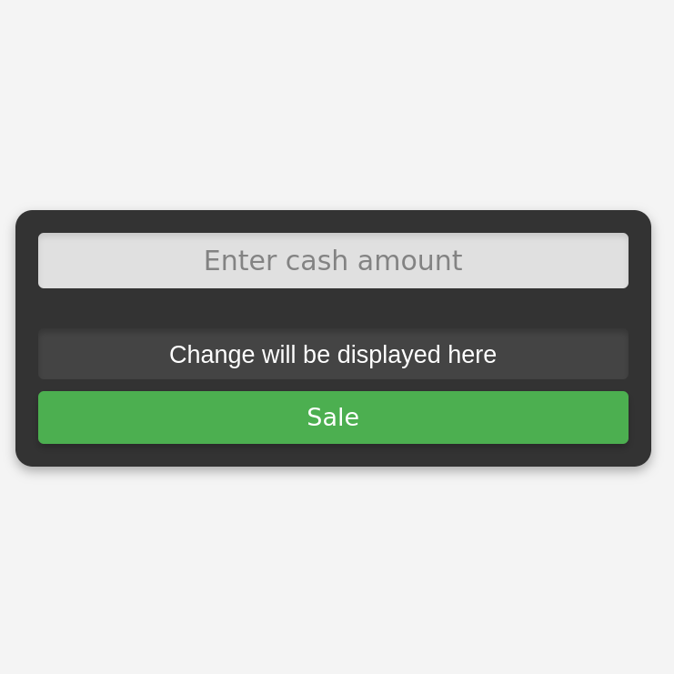
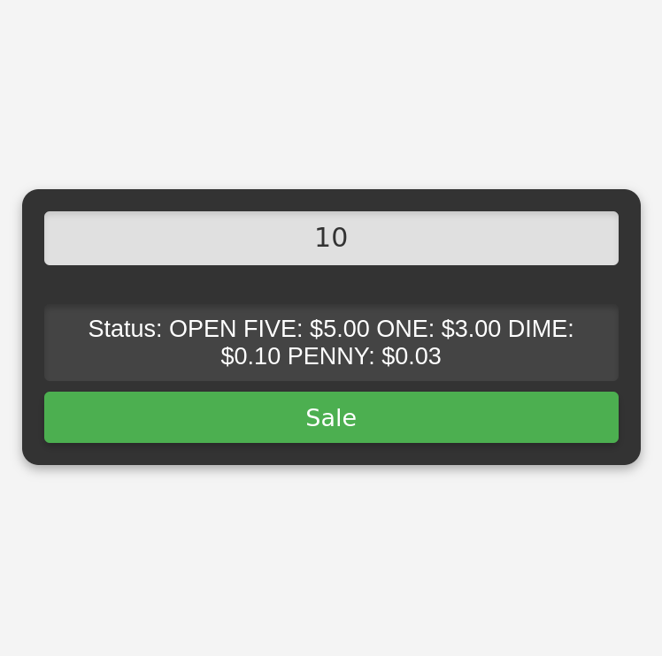

# Cash Register App

A simple web application that calculates and returns the correct change to the customer based on the item's price, the amount of cash provided, and the cash available in the drawer. This project is built as part of the FreeCodeCamp JavaScript Algorithms and Data Structures Certification.

## Project Requirements
- Calculates and returns change for different transactions.
- Handles insufficient funds and exact change scenarios.
- Displays different messages based on the cash-in-drawer and the provided amount.

### Screenshot

